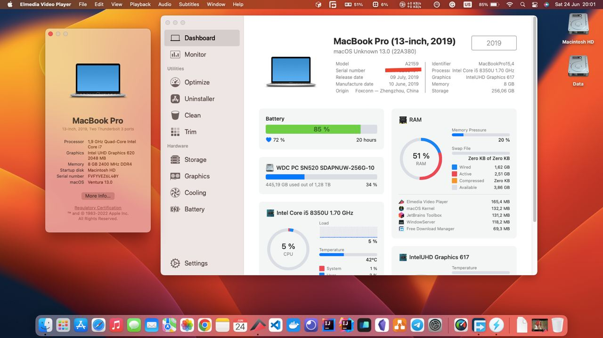

# Hackintosh-HP-Elitebook-830-G5
Hackintosh EFI for Hp EliteBook 830-G5 OpenCore

MacOs Sonoma 14.0 (OpenCore 1.2.1)
  <A href="https://github.com/newtonkiragu/Hackintosh-HP-EliteBook-830-G5-OC/tree/sonoma14.0" target=_blank>Mac OS Sonoma 14.0</A>
  
MacOs Ventura 13.0 (OpenCore 0.9.0)
  <a href="https://github.com/newtonkiragu/Hackintosh-HP-EliteBook-830-G5-OC/tree/ventura" target="_blank">MacOS Ventura 13.0 </a>
  

# Laptop's Hardware

CPU：Intel i5-8350U (crystallake)

GPU ：Intel UHD 620

Wi-Fi：Intel Wireless-AC 8265

SSD：512 GB - Lexar
